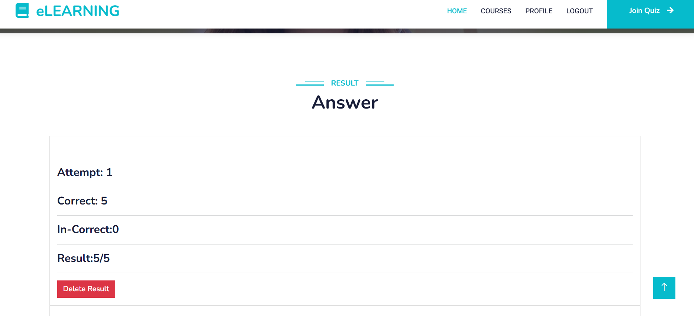

This Laravel-based Online Quiz Exam App provides a seamless quiz-taking experience with real-time results, user authentication, and profile management. Users can log in, take quizzes, and instantly view their scores with detailed results. The app features a responsive dashboard displaying performance analytics and user profiles, ensuring an interactive and engaging learning experience.
